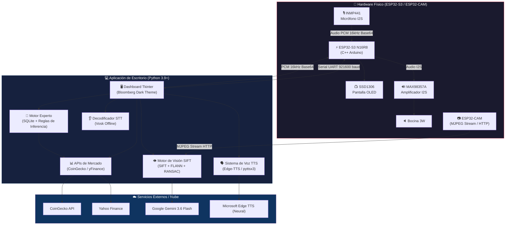
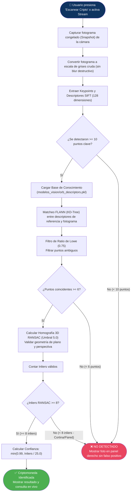
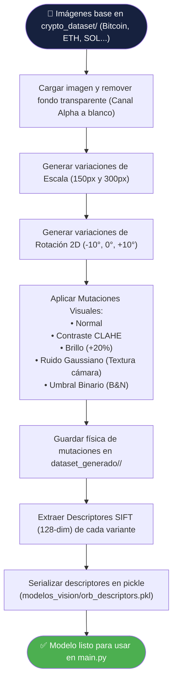
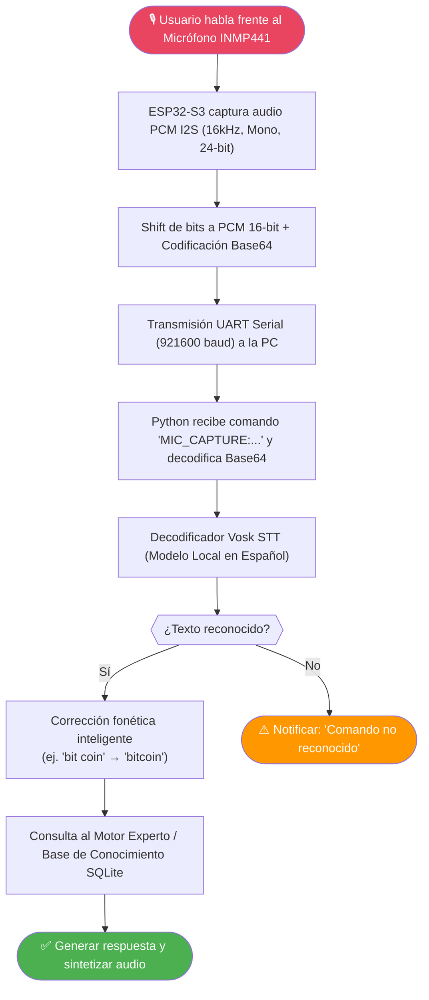
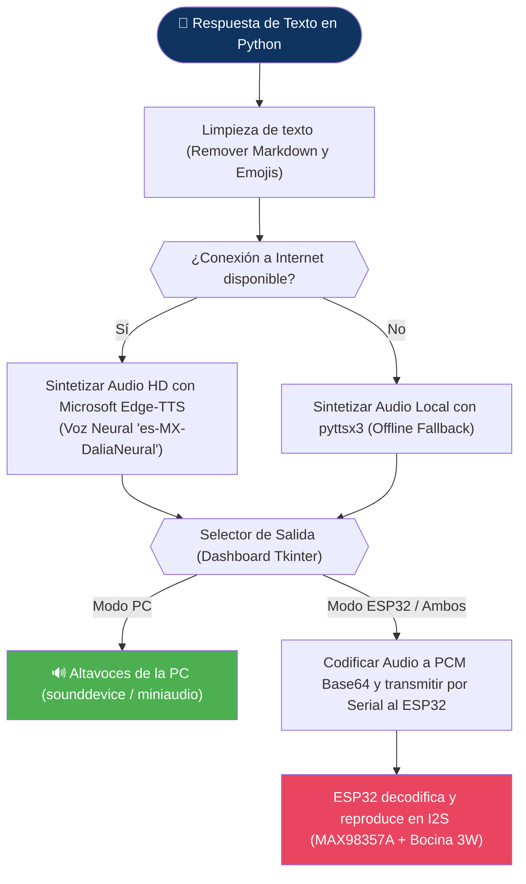

# 🤖 ASISTENTE EDUCATIVO Y FINANCIERO EXPERTO (v2.0 SIFT Vision Edition)


Sistema embebido inteligente y suite de escritorio para educación financiera, análisis bursátil y reconocimiento visual de criptomonedas en tiempo real. Combina hardware físico autónomo (**ESP32-S3 N16R8** con micrófono I2S, amplificador I2S y pantalla OLED) y visión streaming vía **ESP32-CAM**, impulsado por un motor de Visión por Computadora avanzado basado en **SIFT (Scale-Invariant Feature Transform)** con homografía 3D **RANSAC**.

---

## 🎯 DESCRIPCIÓN DEL PROYECTO

El **Asistente Financiero Experto** es una plataforma integral de hardware y software diseñada para interactuar mediante **voz, texto y visión por computadora**. Permite responder preguntas financieras, dar cotizaciones de mercado en vivo (USD / MXN) e identificarcriptomonedas mediante análisis de logotipos en imágenes congeladas (snapshots) o video en vivo.

### ✨ Características Principales:
* **👁️ Motor de Visión SIFT de Alta Precisión (Offline 100%):** Detección de logotipos inmune a rotaciones de 360°, cambios de escala, reflejos y ruido de pantalla, utilizando histogramas de gradiente de 128 dimensiones, matcheo KD-Tree (FLANN) y validación de geometría 3D por homografía RANSAC.
* **📸 Modo Fotografía Instantánea (Snapshot):** Captura en alta resolución al presionar el botón "Escanear Cripto", congelando el fotograma y mostrando inmediatamente la evidencia fotográfica en el panel derecho de la interfaz.
* **🧬 Súper-Entrenamiento y Augmentation:** Generación física de mutaciones visuales (ruido gaussiano, rotaciones 2D, variaciones de escala, binario y contraste) almacenadas en `dataset_generado/` y compiladas a memoria en `modelos_vision/orb_descriptors.pkl`.
* **☁️ Capa Híbrida Cloud (Gemini Vision API):** Integración opcional con la API de Google Gemini 3.6 Flash para reconocimiento secundario en la nube.
* **🗣️ Síntesis de Voz Neuronal HD (Edge-TTS + Fallback Local):** Generación de audio fluido con voces neurales de Microsoft (`es-MX`) y reproducción en altavoces de PC o en la bocina física del circuito.
* **👂 Reconocimiento de Voz Offline (Vosk STT):** Procesamiento de audio local para dictar preguntas directamente desde el micrófono físico **INMP441**.
* **📊 Cotizaciones en Tiempo Real:** Integración directa con **CoinGecko API** y **Yahoo Finance** para obtener precios actualizados en USD y conversión automática a MXN.
* **🖥️ Interfaz Profesional Tkinter (Bloomberg Dark Theme):** Dashboard multitarea con monitoreo de hardware, logs en tiempo real, chat conversacional y catálogo interactivo.

---

## 📐 DIAGRAMAS DE FUNCIONAMIENTO Y ARQUITECTURA

A continuación se presentan los diagramas de flujo completos para cada subsistema del proyecto.

### 1. Arquitectura General del Sistema


---

### 2. Flujo de Visión: Reconocimiento Fotográfico SIFT (Snapshot & Stream)


---

### 3. Flujo de Entrenamiento Visual & Augmentation (`entrenamiento_mejorado.py`)


---

### 4. Flujo de Entrada de Voz (Micrófono INMP441 → Vosk STT → Motor Experto)


---

### 5. Flujo de Salida de Voz & Audio (Texto → Edge-TTS → Altavoces / Bocina ESP32)


---

## 👁️ DETALLES TÉCNICOS DEL MOTOR DE VISIÓN

### ¿Por qué SIFT y no ORB?
Anteriormente el sistema utilizaba **ORB (Oriented FAST and Rotated BRIEF)**. Si bien ORB es sumamente rápido, utiliza descriptores binarios de solo 32 dimensiones basados en esquinas simples. En escenarios reales con cámaras web de baja resolución (como la ESP32-CAM) fotografiando pantallas de computadora o impresiones:
* ORB sufría por interferencia de patrones de textura (Moiré).
* Confundía fondos rugosos (cortinas, paredes, persianas) con logotipos.
* No realizaba verificación de profundidad plana o perspectiva.

**La Solución SIFT (Scale-Invariant Feature Transform):**
1. **Histogramas de Gradiente de 128 Dimensiones:** SIFT analiza la orientación de los gradientes de intensidad en múltiples escalas del espacio de escala Gaussiano. Es completamente invariante a rotaciones de 360°, cambios de escala (zoom) e iluminación.
2. **Matcheo FLANN (Fast Library for Approximate Nearest Neighbors):** Utiliza un árbol de búsqueda `KD-Tree` (5 árboles, 50 comparaciones) para encontrar los vecinos más cercanos en el espacio vectorial de 128 dimensiones entre la foto tomada y la base de datos de entrenamiento.
3. **Filtro de Ratio de Lowe (0.75):** Compara la distancia del vecino más cercano contra el segundo vecino más cercano ($d_1 < 0.75 \times d_2$). Si el ratio es mayor a 0.75, la coincidencia se descarta por ambigua.
4. **Validación de Geometría 3D por Homografía RANSAC:** Se construye una matriz de transformación de plano de $3 \times 3$ entre los puntos del logotipo y los de la imagen tomada. Si un punto no cumple geométricamente la ecuación del plano, es descartado como *Outlier*. Solo los *Inliers* (puntos matemáticamente válidos en el mismo plano) cuentan para la detección.
5. **Umbral Anti-Falsos Positivos (>= 8 Inliers):** Una pared o cortina solo puede generar 1 o 2 inliers accidentales; al requerir al menos 8 inliers validados por RANSAC, los falsos positivos se reducen a cero.

---

## 🗣️ SÍNTESIS Y RECONOCIMIENTO DE VOZ

### 1. Síntesis de Voz (TTS)
El sistema implementa una arquitectura híbrida de voz:
* **Capa Principal (Online HD):** Utiliza la librería `edge-tts` que se conecta a los servicios de síntesis neural de Microsoft Azure/Edge, produciendo voz natural mexicana (`es-MX-DaliaNeural` o `es-MX-JorgeNeural`).
* **Capa Secundaria (Offline Fallback):** Si no hay conexión a internet, conmuta automáticamente a `pyttsx3` / SAPI5 local.

### 2. Canales de Audio
Desde el panel de control de la GUI se puede seleccionar dónde debe sonar el asistente:
1. **Altavoces de la PC:** Reproducción directa con la tarjeta de sonido de la computadora.
2. **Bocina Física (ESP32-S3):** El audio procesado se transmite en paquetes Base64 por el puerto serie, donde el ESP32-S3 los convierte en muestras PCM I2S hacia el amplificador **MAX98357A** y la bocina de 3W.

---

## 🔌 HARDWARE UTILIZADO Y CONEXIONES (ESP32-S3)

Para operar en **Modo Hardware**, estas son las conexiones exactas hacia el microcontrolador **ESP32-S3 N16R8**:

### 1. Pantalla OLED SSD1306 (I2C)
| ESP32-S3 Pin | SSD1306 | Función |
| :--- | :--- | :--- |
| **GPIO 41** | SDA | Datos I2C |
| **GPIO 42** | SCL | Reloj I2C |
| **3V3** | VCC | Alimentación 3.3V |
| **GND** | GND | Tierra |

### 2. Micrófono MEMS I2S INMP441
| ESP32-S3 Pin | INMP441 | Función |
| :--- | :--- | :--- |
| **GPIO 5** | SCK (BCLK) | Reloj de bits I2S |
| **GPIO 4** | WS (LRCK) | Selección de canal |
| **GPIO 6** | SD (DOUT) | Datos de salida audio |
| **GND** | L/R | Canal Izquierdo (Mono) |
| **3V3** | VDD | Alimentación 3.3V |

### 3. Amplificador I2S MAX98357A + Bocina 3W
| ESP32-S3 Pin | MAX98357A | Función |
| :--- | :--- | :--- |
| **GPIO 15** | BCLK | Reloj de bits I2S |
| **GPIO 16** | LRC | Selección de canal |
| **GPIO 7** | DIN | Entrada datos audio |
| **5V / VIN** | VIN | Alimentación (Recomendado 5V) |
| **GND** | GND | Tierra |
| **—** | + / - | Bocina 4Ω/8Ω de 3W |

---

## 🚀 GUÍA DE INSTALACIÓN Y USO PASO A PASO

### Requisitos Previos
* **Python 3.9 o superior** instalado (marcar "Add Python to PATH" durante la instalación).
* **Git** instalado (opcional).

---

### Paso 1: Clonar el Repositorio e Instalar Dependencias

```powershell
# Clonar proyecto
git clone https://github.com/Daniel-Macias-hub/Asistente-Financiero-Experto.git
cd Asistente-Financiero-Experto

# Instalar librerías de Python
pip install -r requirements.txt
```

*(O haz doble clic en `instalar_dependencias.bat` en Windows).*

---

### Paso 2: Inicializar la Base de Datos de Conocimiento

Antes de la primera ejecución, carga la base de datos de preguntas y conceptos financieros:
```powershell
python inicializar_datos.py
```

---

### Paso 3: Entrenar el Modelo de Visión SIFT

Para que la IA aprenda los logotipos de la carpeta `crypto_dataset/`, genere las mutaciones en `dataset_generado/` y compile la base de conocimiento vectorial en `modelos_vision/orb_descriptors.pkl`, ejecuta:

```powershell
python entrenamiento_mejorado.py
```

*Salida esperada:*
```text
Iniciando súper-entrenamiento SIFT (Gradient Histograms, Vectores, Ruido)...
[OK] bitcoin: 258 mutaciones visuales aprendidas.
[OK] bnb: 270 mutaciones visuales aprendidas.
...
✅ Súper-Entrenamiento finalizado.
🎯 Monedas identificables: 7
🧠 Puntos de conocimiento puro extraídos: ~300,000
```

---

### Paso 4: Iniciar la Aplicación Principal

```powershell
python main.py
```

1. Se abrirá el **Dashboard Profesional de Operaciones**.
2. **Para escanear una criptomoneda:**
   * Ve a la pestaña **Chat Conversacional**.
   * Pon la imagen o pantalla con el logotipo frente a la cámara.
   * Presiona el botón **Escanear Cripto**.
   * La aplicación congelará la foto, la desplegará inmediatamente en el panel derecho de la interfaz y mostrará la identificación y precio en tiempo real.

---

## 📁 ESTRUCTURA DEL PROYECTO

```text
Asistente-Financiero-Experto/
├── main.py                     # Punto de entrada de la aplicación Tkinter
├── config.py                   # Rutas globales, constantes y configuración
├── entrenamiento_mejorado.py   # Script de Súper-Entrenamiento SIFT y Augmentation
├── inicializar_datos.py        # Poblador inicial de la BD SQLite
├── requirements.txt            # Dependencias pip de Python
├── crypto_dataset/             # Imágenes originales base (Bitcoin, ETH, SOL...)
├── dataset_generado/           # Mutaciones generadas físicamente (ruido, B&N, etc.)
├── modelos_vision/             # Base de datos vectorial binaria (orb_descriptors.pkl)
├── vision/                     # Módulos de visión por computadora
│   ├── detector_logo.py        # DetectorSIFT (FLANN + RANSAC) y Gemini Vision API
│   └── clasificador.py         # Orquestador del clasificador visual
├── experto/                    # Motor de inferencia y consultas
│   ├── router.py               # Enrutador de preguntas (Precios / Definiciones)
│   ├── reglas.py               # Encadenamiento de conocimiento financiero
│   └── finanzas_tiempo_real.py # Integración CoinGecko / yFinance
├── conocimiento/               # Base de datos local
│   ├── database.py             # Conexión y tablas SQLite3
│   └── CRUD.py                 # Consultas a la base de datos
├── audio/                      # Módulos de sonido y voz
│   ├── tts.py                  # Síntesis Edge-TTS y pyttsx3
│   └── stt.py                  # Reconocimiento de voz local con Vosk
├── interfaz/                   # Interfaz gráfica Tkinter
│   ├── app.py                  # Ventana principal y chat conversacional
│   ├── panel_camara.py         # Canvas de visión y stream de video
│   └── dashboard.py            # Tarjetas de monitoreo de mercado y hardware
└── firmware/                   # Código Arduino C++ para el ESP32-S3
```

---

## 📜 LICENCIA Y AUTORÍA

Desarrollado como una suite avanzada de arquitectura de hardware embebido, sistemas expertos e Visión por Computadora.

* **Licencia:** MIT
