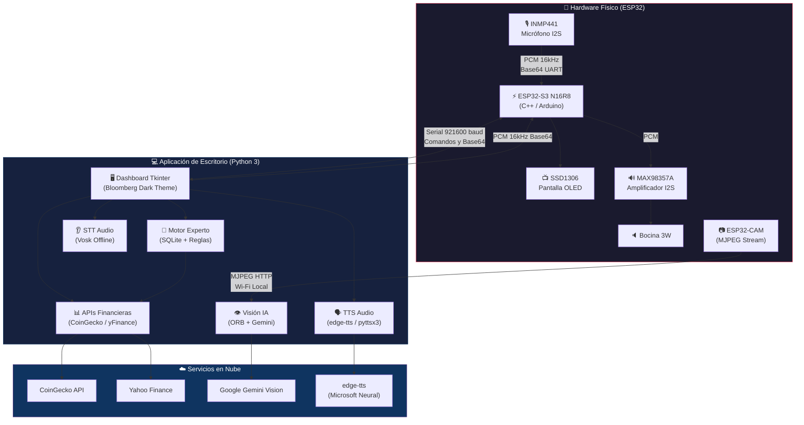
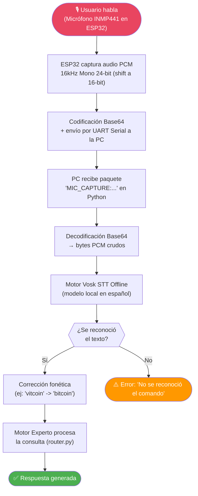
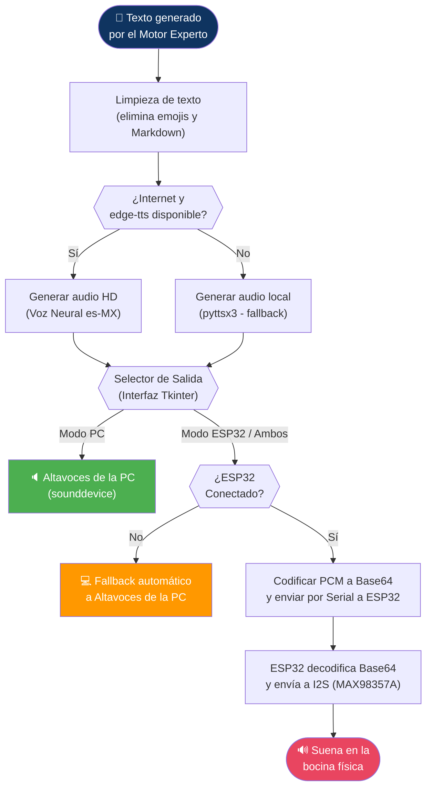
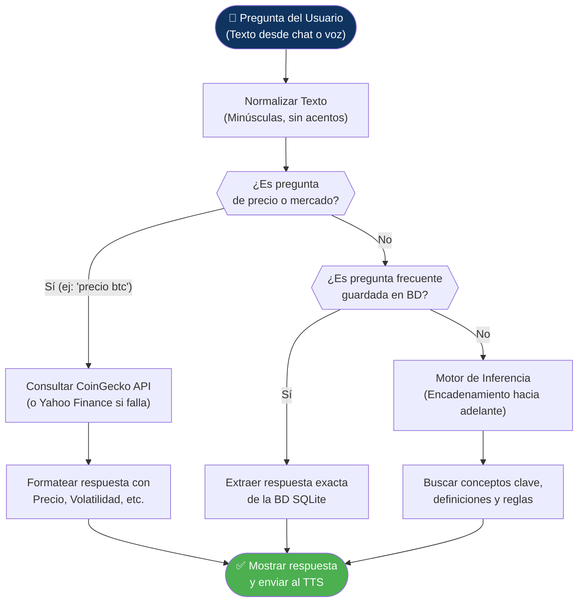
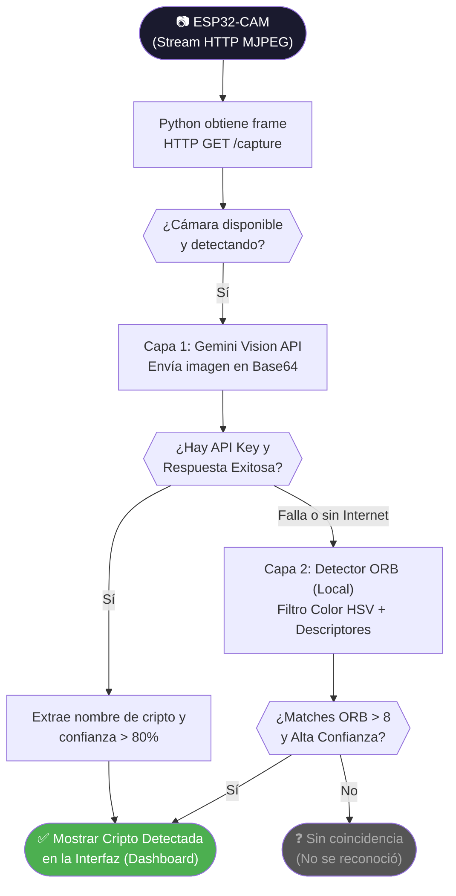

# 🤖 ASISTENTE EDUCATIVO Y FINANCIERO EXPERTO


Sistema embebido inteligente y suite de escritorio para educación financiera, análisis bursátil y reconocimiento de divisas/criptomonedas mediante visión por computadora y voz. Opera de manera integral con un circuito físico autónomo (**ESP32-S3 N16R8**) equipado con micrófono I2S, amplificador I2S, pantalla OLED y visión streaming en tiempo real vía **ESP32-CAM**.

---

## 🎯 DESCRIPCIÓN DEL PROYECTO

El **Asistente Financiero Experto** es una solución de hardware y software diseñada para interactuar con el usuario de manera natural (voz y visión) y brindar asistencia en tiempo real sobre educación financiera, cotización del mercado y reconocimiento visual de criptomonedas.

### ✨ Características Principales:
* **Entrada de Voz Física:** Captura de comandos de voz mediante el micrófono I2S **INMP441**.
* **Salida de Audio en Circuito:** Reproducción de respuestas sintetizadas (TTS) a través del amplificador I2S **MAX98357A** y bocina de 3W.
* **Interfaz de Pantalla Embebida:** Animaciones de estado y retroalimentación visual en pantalla **OLED SSD1306**.
* **Visión Remota en Tiempo Real:** Transmisión MJPEG y captura de fotos vía **ESP32-CAM**.
* **Reconocimiento Visual IA:** Detección de logotipos cripto con un sistema de dos capas: **ORB (Offline)** y **Google Gemini Vision (Nube)**.
* **Dashboard Profesional (Estilo Bloomberg):** Interfaz gráfica en PC hecha con **Tkinter**, con tema oscuro y métricas en tiempo real.
* **Motor Experto Local:** Base de conocimientos en **SQLite3** que permite responder definiciones y relacionar conceptos financieros usando lógica de encadenamiento.

---

## 🖥️ MODOS DE OPERACIÓN

### 1️⃣ Modo Completo (Hardware ESP32 + PC)
Requiere el microcontrolador ESP32-S3, ESP32-CAM y todos los componentes físicos armados. Habilita el audio a través de la bocina física, muestra animaciones en la pantalla OLED y permite analizar objetos con la cámara.

### 2️⃣ Modo Solo PC (Sin hardware, ideal para pruebas)
Permite usar el **chat conversacional** y las **consultas financieras en tiempo real** directamente desde la computadora sin necesidad de armar el circuito.
1. Ejecuta el archivo `main.py` en tu PC.
2. Escribe tu pregunta en la pestaña de chat y presiona **Enviar**.
3. La respuesta aparecerá en pantalla y el asistente la **leerá en voz alta** usando los altavoces de tu computadora.

> [!NOTE]
> En modo "Solo PC", el ESP32 aparecerá como **DESCONECTADO** en el panel de control — esto es completamente normal y el sistema funcionará sin problemas.

---

## 📐 DIAGRAMAS DE FUNCIONAMIENTO (FLUJOS)

A continuación, se detalla paso a paso cómo funciona internamente el sistema. Estos diagramas son clave para entender la interacción entre los diferentes módulos.

### 1. Arquitectura General del Sistema


### 2. Flujo de Voz — Entrada (Micrófono → STT → Texto)


### 3. Flujo de Audio — Salida (Texto → TTS → Bocina)


### 4. Flujo de Consultas Financieras y Lógica


### 5. Flujo de Visión — Reconocimiento de Criptomonedas


---

## 🔌 HARDWARE UTILIZADO Y PINOUT (ESP32-S3)

Si decides armar el hardware físico, estas son las conexiones exactas hacia tu **ESP32-S3 N16R8**:

### 1. Pantalla OLED SSD1306 (I2C)
| ESP32-S3 Pin | SSD1306 | Función |
| :--- | :--- | :--- |
| **GPIO 41** | SDA | Datos I2C |
| **GPIO 42** | SCL | Reloj I2C |
| **3V3** | VCC | Alimentación 3.3V |
| **GND** | GND | Tierra |

### 2. Micrófono MEMS I2S INMP441
| ESP32-S3 Pin | INMP441 | Función |
| :--- | :--- | :--- |
| **GPIO 5** | SCK (BCLK) | Reloj de bits I2S |
| **GPIO 4** | WS (LRCK) | Selección de canal |
| **GPIO 6** | SD (DOUT) | Datos de audio salida |
| **GND** | L/R | Canal Izquierdo (Mono) |
| **3V3** | VDD | Alimentación 3.3V |

### 3. Amplificador I2S MAX98357A + Bocina 3W
| ESP32-S3 Pin | MAX98357A | Función |
| :--- | :--- | :--- |
| **GPIO 15** | BCLK | Reloj de bits I2S |
| **GPIO 16** | LRC | Selección de canal |
| **GPIO 7** | DIN | Datos de audio entrada |
| **5V / VIN** | VIN | Alimentación (Recomendado 5V) |
| **GND** | GND | Tierra |
| **—** | + / - | Bocina 4Ω/8Ω de 3W |

---

## ⚙️ GUÍA DE INSTALACIÓN PASO A PASO (Para Principiantes)

Para ejecutar este proyecto, necesitas configurar dos entornos: el entorno de software en tu PC (Python) y el firmware del microcontrolador (Arduino IDE).

### Fase 1: Preparación del Entorno en la PC (Python)

1. **Descargar Python:**
   Asegúrate de tener instalado **Python 3.9 o superior**. Durante la instalación en Windows, marca la casilla **"Add Python to PATH"**.
   
2. **Clonar el proyecto:**
   Descarga este proyecto como ZIP o clónalo con git:
   ```powershell
   git clone https://github.com/Daniel-Macias-hub/Asistente-Financiero-Experto.git
   cd Asistente-Financiero-Experto
   ```

3. **Instalar dependencias:**
   Haz doble clic en el archivo `instalar_dependencias.bat` que está en la carpeta principal. Esto instalará automáticamente todas las librerías necesarias.
   *(Alternativamente, puedes abrir la terminal y escribir: `pip install -r requirements.txt`)*.

4. **Configurar la API Key (Opcional pero recomendado para Visión):**
   * Crea un archivo llamado `.env` en la raíz del proyecto.
   * Consigue una clave gratuita de Google Gemini AI y añádela al archivo así:
     ```env
     GEMINI_API_KEY=tu_api_key_aqui
     ```

5. **Inicializar la Base de Datos:**
   Antes de correr el programa por primera vez, necesitas crear y poblar la base de datos de conocimientos:
   ```powershell
   python inicializar_datos.py
   ```

### Fase 2: Configuración del ESP32-S3 (Arduino IDE)
*(Si solo quieres usar el "Modo PC", puedes omitir esta fase).*

1. **Instalar Arduino IDE:**
   Descarga la versión más reciente desde [arduino.cc](https://www.arduino.cc/en/software).
2. **Añadir el soporte para ESP32:**
   * En Arduino IDE ve a *Archivo -> Preferencias*.
   * En "Gestor de URLs Adicionales de Tarjetas", pega: `https://raw.githubusercontent.com/espressif/arduino-esp32/gh-pages/package_esp32_index.json`
   * Ve a *Herramientas -> Placa -> Gestor de placas*, busca **esp32** por Espressif y dale a instalar.
3. **Instalar Librerías en Arduino:**
   Ve a *Programa -> Incluir Librería -> Gestionar Librerías...* y busca e instala:
   * **Adafruit GFX Library**
   * **Adafruit SSD1306**
4. **Subir el Firmware:**
   * Abre el archivo `firmware/esp32_s3_arduino/esp32_s3_arduino.ino`.
   * En *Herramientas -> Placa*, selecciona **ESP32S3 Dev Module**.
   * Selecciona el puerto COM correcto donde está conectada tu placa.
   * Haz clic en el botón de **Subir** (flecha hacia la derecha).

> [!TIP]
> Si tienes una ESP32-CAM, cárgale un código estándar de "CameraWebServer" (que viene de ejemplo en Arduino IDE). Asegúrate de que la cámara se conecte a la misma red Wi-Fi que tu PC, y actualiza la URL en el panel de cámara de la interfaz Python si es necesario.

### Fase 3: ¡A Disfrutar!

Una vez completados los pasos, simplemente ejecuta la aplicación en tu computadora:
```powershell
python main.py
```
Se abrirá la ventana principal (Dashboard estilo Bloomberg). Si tu placa ESP32 está conectada por USB, el sistema la detectará automáticamente.

---

## 📋 DIAGNÓSTICO AUTOMATIZADO INTEGRADO

El sistema en Python incluye herramientas de autodiagnóstico para el hardware, que se pueden ejecutar desde la interfaz gráfica:

1. **Test OLED:** Ejecuta una animación en la pantalla para comprobar comunicación I2C.
2. **Test Bocina:** Reproduce una melodía a 440Hz / tonos musicales para validar el amplificador MAX98357A.
3. **Test Micrófono:** Graba 5 segundos de audio, calcula el nivel RMS (volumen) en la PC y luego lo reproduce por la bocina para confirmar que el INMP441 funciona.
4. **Test Cámara:** Verifica la conexión HTTP y muestra el stream en vivo.

---

## ⚠️ PROBLEMAS CONOCIDOS Y SOLUCIONES

* **Puerto Serie Retenido / Error de Acceso (COMx):** Si estás programando o subiendo código, cierra Arduino IDE o tu terminal serial antes de correr `main.py`, ya que solo un programa puede usar el puerto USB a la vez.
* **Retardo (Lag) en Audio TTS:** Si tu internet es lento, la síntesis con `edge-tts` puede demorar unos segundos. El sistema cambiará automáticamente a `pyttsx3` (Voz robótica offline) si falla.
* **La ESP32-CAM no conecta:** Verifica que esté en la misma red Wi-Fi. Puedes revisar su IP conectando el monitor serie al momento de encenderla.

---

## 📜 LICENCIA Y AUTORÍA

Proyecto de arquitectura compleja de hardware embebido e IA.
Licencia **MIT**.

